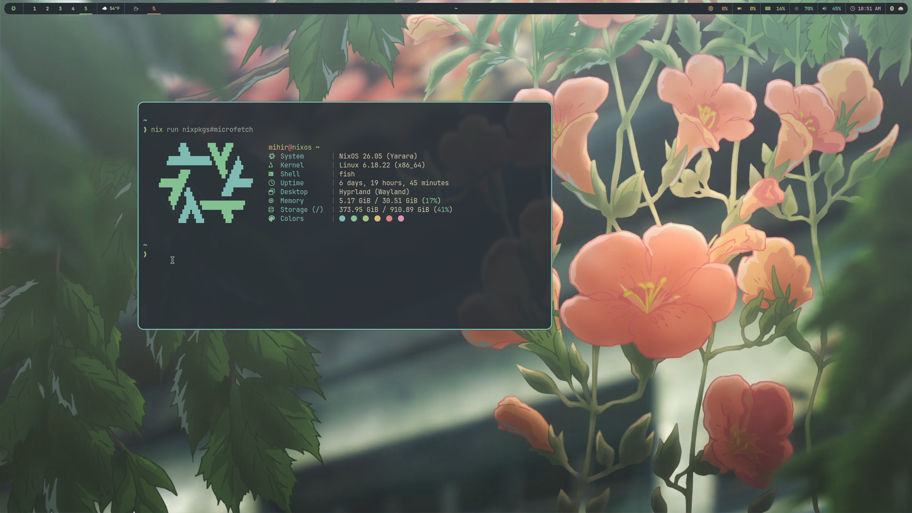
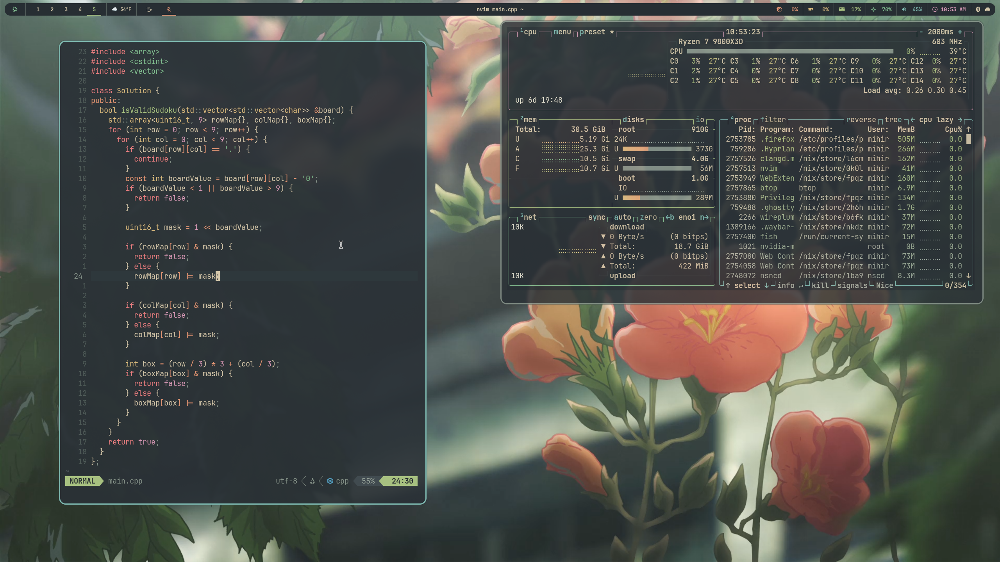
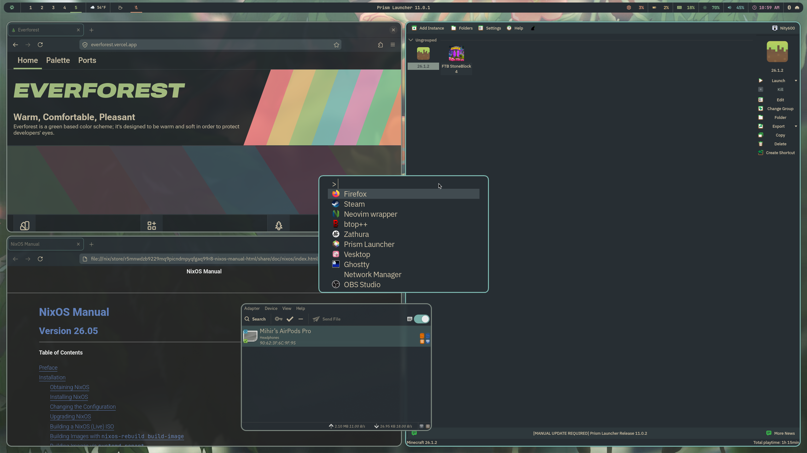
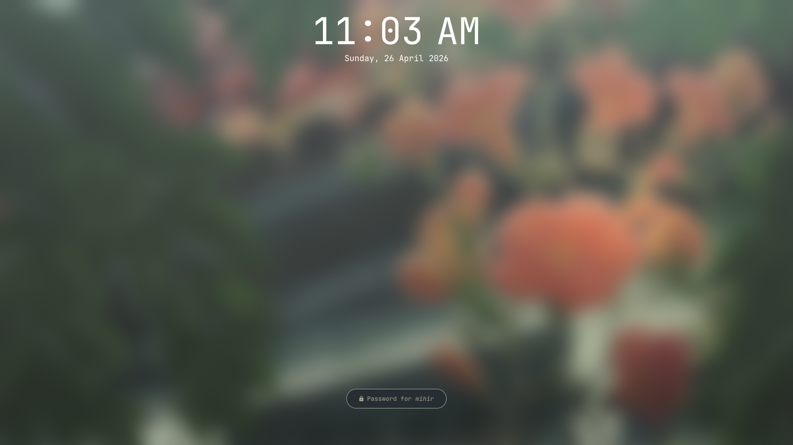

# Dotfiles
A Nix Flake providing cross-platform dotfiles and system configurations for my
NixOS, macOS (nix-darwin), and WSL machines.

## Structure
- `machines/`: Minimal system-level configurations for each host.
- `home-manager/`: Most configuration lives here. Userland programs (Hyprland
  btw, Neovim btw) are managed here.
    - `common/`: Modules applied indiscriminately to every machine.
    - `shareable/`: Optional modules that can be chosen per-host.

## Screenshots

  
  
  
  

## Discussion
Feel free to open an issue for questions or suggestions!
