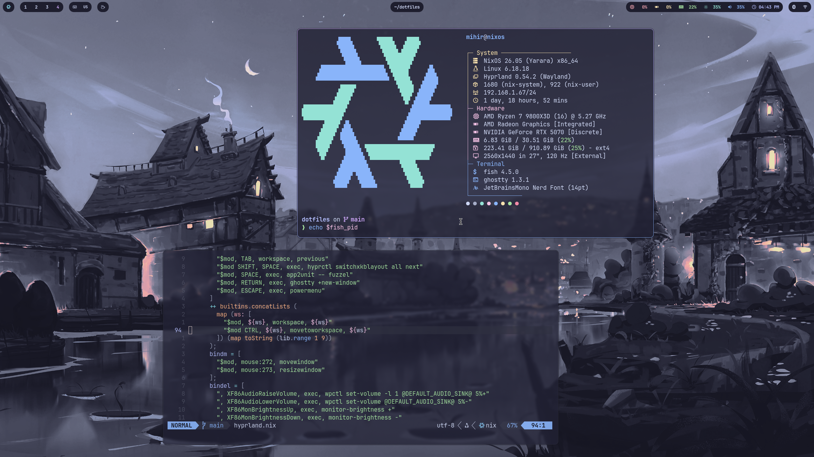
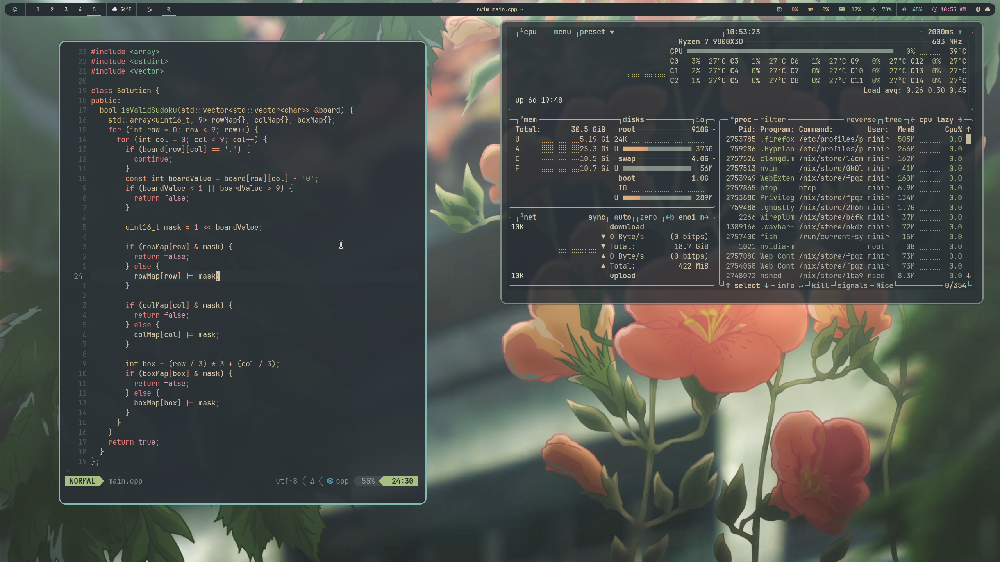
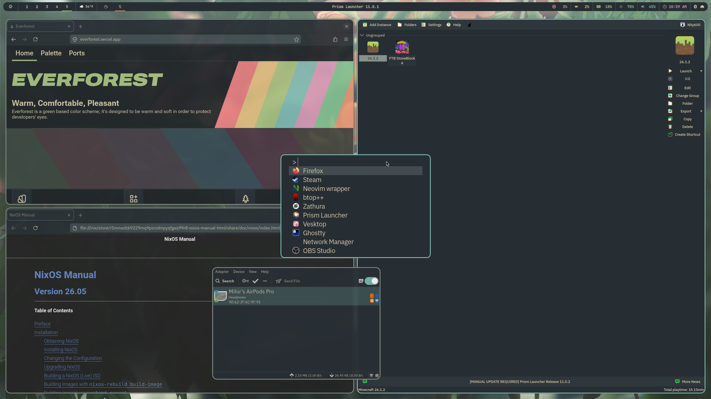
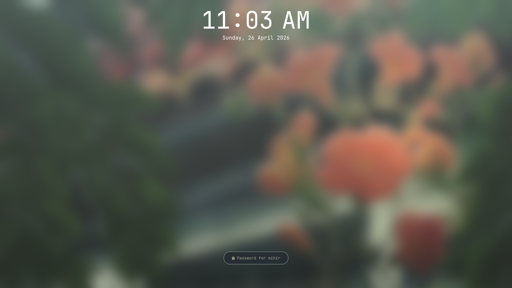

# Dotfiles
A Nix Flake configuration for my NixOS desktop.

## Structure
- `machines/`: System-level configurations for each host.
- `home-manager/`: Most program configuration is here. Userland programs
  (Hyprland btw, Neovim btw, etc.) are managed here. The `common/` directory
  contains modules applied indiscriminately to every machine.

## Screenshots

  
  
  
  

## Discussion
Feel free to open an issue for questions or suggestions!
